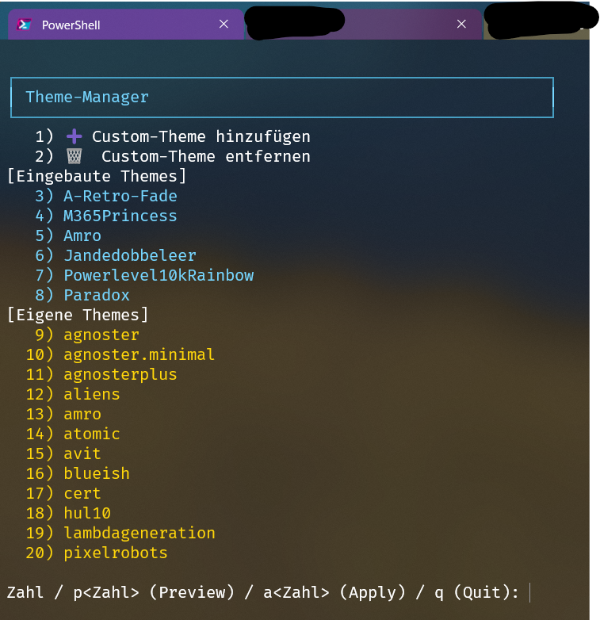

# 🖥️ PowerShell Profile & Theme Manager

Dieses Repository enthält mein persönliches **PowerShell-Profil** für **PowerShell 7** mit Integration von [oh-my-posh](https://ohmyposh.dev/).  
Es bietet einen interaktiven **Theme-Manager (`mythemes`)**, mit dem man Themes komfortabel auswählen, previewen und anwenden kann.

---

## 🚀 Features

- Automatisches Laden des zuletzt verwendeten Themes oder Fallback auf ein Default-Theme.
- Interaktives Menü `mythemes`:
  - Eingebaute Themes und eigene Custom-Themes in einer Liste.
  - Vorschau (`pN`) in einem neuen PowerShell-Fenster.
  - Anwenden (`aN` oder nur `N`) direkt im aktuellen Fenster.
  - Hinzufügen (`n`) und Entfernen (`d`) von eigenen Themes.
- Verwaltung eigener Themes in einer JSON-Datei (`$env:USERPROFILE\.omp_custom_themes.json`).
- Adaptive Farbausgabe (High Contrast möglich).
- Robuste Fehlerbehandlung und saubere Klammerstruktur.

---
## 📸 Screenshot

Hier ein Beispiel, wie es aussieht:



---

## ⚙️ Installation

1. **Repository klonen:**
   ```powershell
   git clone https://github.com/<DEIN-BENUTZERNAME>/<DEIN-REPO>.git
   cd <DEIN-REPO>
   ```

2. **Vorhandenes Profil sichern:**
   ```powershell
   Copy-Item $PROFILE "$PROFILE.bak"
   ```

3. **Neues Profil installieren:**
   ```powershell
   Copy-Item .\Microsoft.PowerShell_profile.ps1 $PROFILE -Force
   ```

4. **Profil neu laden oder PowerShell neu starten:**
   ```powershell
   . $PROFILE
   ```

---

## 🧑‍💻 Verwendung

- Direkt beim Start wird dein letztes Theme geladen (oder ein Default-Theme).  
- Mit `mythemes` kannst du Themes interaktiv verwalten:

  - `3` → Theme Nr. 3 sofort anwenden  
  - `p3` → Theme Nr. 3 in neuem Fenster previewen  
  - `n` → neues Custom-Theme per URL hinzufügen  
  - `d` → gespeichertes Custom-Theme löschen  
  - `q` → Menü verlassen  

---

## 📂 Dateien

- **Microsoft.PowerShell_profile.ps1** – Hauptprofilskript  
- **.omp_custom_themes.json** – (automatisch erstellt) Liste benutzerdefinierter Themes  
- **.omp_last_theme.txt** – (automatisch erstellt) speichert das zuletzt genutzte Theme  

---

## 🔧 Voraussetzungen

- [PowerShell 7](https://github.com/PowerShell/PowerShell)  
- [oh-my-posh](https://ohmyposh.dev/docs/installation/windows)  
- Optional: [Terminal-Icons](https://www.powershellgallery.com/packages/Terminal-Icons) & `Microsoft.WinGet.CommandNotFound`  

---

## ✨ Hinweis

Dieses Profil ist individuell auf meinen Workflow zugeschnitten.  
Du kannst es gerne forken und eigene Anpassungen vornehmen.
